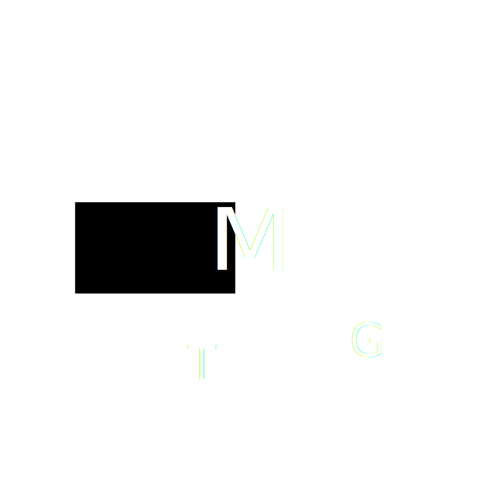

class: left, middle, slide-title

# Using AWS Lambda to Create Weather GIFs

## .subtitle[Seth Miller and Edan Schwartz]

#### .inline-logo[] Sponsored By: AerisWeather

???
Good luck! We got this!
---
class: slide-secondary

# What is Lambda? (Real Quick!)

1. Functional and Stateless Compute - Give it code and an input
	1. Reacts to various AWS events
	1. DB Inserts via DynamoDB
	1. API Events via API Gateway
--
count: false
1. Charged per 100ms used at CPU/RAM levels
	1. EC2 is hourly
--
count: false
1. No Ops - Manage only code
--
count: false

	1. ... and VPC
	1. ... and Security Groups
	1. ... and Triggers
	1. ... and Env Config
--
count: false

.summary["No OPs" is really more like "Less OPs"]
???
Just as a quick overview

---
class: slide-secondary
# What is Lambda good for?

1. Batch Processing
	1. Massively parallel - 1000 concurrent by default
1. Small Compute
	1. Charged in 100ms increments
	1. No idling EC2 Server
1. Spikey Workloads

---
class: slide-primary

# Our Needs

1. Fine grained usage based pricing
	1. Large data sets coming in hourly, every 6 hours
	1. Idle resources
	1. Hard to scale up/down preemptively
???
Forecasts primary motivator
Timers kind of work but off hour still paying for hour
--
count: false
1. Parallel processing jobs
	1. Each should finish < 30 seconds
	1. Time to market is important for our customers
	
--
count: false
1. Reference old data, combine new data
	1. More than just a pipeline
	1. Forking and data re-use
--
count: false

.summary[Need: Very scalable compute solution, only charged us for time used, even less than an hour.]

???
What drove us to Lambda
---
class: slide-primary
# Why did we choose Lambda?

1. Massive concurrency
	1. Can spin up thousands of cores - Time to Market
1. We have Spikey Workloads!
	1. Fine grained cost helps a lot - sub hourly
1. Metrics for each Lambda function
	1. CloudWatch dashboards
1. Competitors
	1. Google Cloud Functions – Still in Beta
	1. Windows Azure Functions – It isn't AWS
	1. Open Whisk – Uses containers, cool, not a lot of support
	
---
class: left, middle, slide-title-alt
# Data Flow Pattern .inline-icon[]
## Coordinating microservices (like Lambda)

---
class: slide-secondary
# Data Flow Architecture
## What is it?

1. Smart Mediator - The Brains .img-float-right[.size-height-150px[]]
	1. Where config lives
	1. Decider
	1. DB Requests
	1. Outputs messages to all workers
--
count: false

1. Dumb Workers - "Pure" Functions .img-float-right[.size-height-150px[]]
	1. Take in single type of message
	1. Do work described in message
	1. Output result description back to mediator
	
.summary[A smart mediator leads dumb workers, deploy independently]
	
---
name:data-flow-pattern
class: slide-secondary
# Data Flow Pattern
## A smart way to organize microservices

1. Based on Simple Workflow Service
	1. SWS didn't really seem "Simple"
	1. Verbose config for each thing
	1. Forking workflows difficult
--

1. Why Data Flow?
	1. Need more advanced Workflows
	1. Microservice coordination
	1. Avoid sequential spaghetti with a common interface

???
More than a bunch of random functions calling each other
---
class: left, middle, slide-title-alt
# Demo .inline-icon[]
## AWS Lambda - Creating Weather GIFs

---
class: slide-secondary large-content
# Demo - Design

## Problem: Need a weather gif and thumbnails
1. Download each image (on a timer/manually)
1. For each image create a thumbnail
1. Once we have [X] frames, create weather gif
1. Send us an email when it's done

.summary[Simple example, but scales really well!]

---
class: slide-secondary
# Demo - Design

.center[.size-height-full[]]

---
class: slide-secondary large-content
# Demo - Resources needed

* **DB** - For saving state, DynamoDB
* **Shared File Storage** - Worker storage, S3
* **4 Workers** - Lambda functions for Fetching, Thumbnail Creation, Gif Creation, Emailing
* **1 Mediator** - Lambda function to coordinate it all

---
class: slide-primary
# Fetcher
## Get an image via URL, save image to shared storage

Receives "please" message from outside source (timer/manually):
```json
{
  "type": "please-fetch-amp-image",
  "dateCreated": 123456789,
  "imageId": "temps",
  "layers": [
    "flat-dk",
    "temperatures"
  ],
  "width": 800,
  "height": 600,
  "center": "tulsa,ok",
  "zoom": 4,
  "validTime": 2345678910
}
```

---
class: slide-primary
# Fetcher
## Get an image via URL, save image to shared storage

Fetches image, saves in storage location of worker's choice (shared)

Will send a "did" message to mediator:
```json
{
  "type": "did-fetch-amp-image",
  "dateCreated": 123456789,
  "imageId": "temps",
  "validTime": 4567891011,
  "location": {
    "Bucket": "osn2017-aeris-abcd",
    "Key": "amp-image-fetcher/[bunch of stuff].png"
  }
}
```

---
class: left, middle, slide-title-alt
# [Fetcher Code] .inline-icon[]
## DEMO: Get an image via URL, save image to S3

???
In depth
* Fetch
* Save
* Send Message Back
---
class: slide-primary
# Thumbnail Creator
## Load image from S3, resize/crop, save to S3

Receives "please" message (from mediator):
```json
{
  "type": "please-create-thumbnail",
  "imageId": "temps",
  "location": {
    "Bucket": "osn2017-aeris-abcd",
    "Key": "amp-image-fetcher/[bunch of stuff].png"
  },
  "width": 200,
  "height": 200,
  "validTime": 100
}
```

---
class: slide-primary
# Thumbnail Creator
## Load image from S3, resize/crop, save to S3

Will send a "did" message to mediator:
```json
{
  "type": "did-create-thumbnail",
  "dateCreated": 123456789,
  "imageId": "temps",
  "validTime": 4567891011,
  "location": {
    "Bucket": "osn2017-aeris-abcd",
    "Key": "thumbnail-creator/[bunch of stuff].png"
  }
}
```

---
class: left, middle, slide-title-alt
# [Thumbnail Code] .inline-icon[]
## DEMO: Get an image via URL, save image to S3

???
Go quick, similar to fetcher
---
class: slide-primary
# Gif Creator
## Load list of images from S3, creates GIF, saves

Receives "please" message (from mediator):
```json
{
  "type": "please-create-gif",
  "imageId": "temps",
  "locations": [
    { "Bucket": "osn2017-aeris-abcd", "Key": "gifs-test/1.png" },
    { "Bucket": "osn2017-aeris-abcd", "Key": "gifs-test/2.png" },
    { "Bucket": "osn2017-aeris-abcd", "Key": "gifs-test/3.png" },
    { "Bucket": "osn2017-aeris-abcd", "Key": "gifs-test/4.png" },
    { "Bucket": "osn2017-aeris-abcd", "Key": "gifs-test/5.png" }
  ],
  "validTime": 4567891011
}
```

---
class: slide-primary
# Gif Creator
## Load image from S3, resize/crop, save

Will send a "did" message to mediator:
```json
{
  "type": "did-create-gif",
  "dateCreated": 123456789,
  "imageId": "temps",
  "validTime": 4567891011,
  "location": {
    "Bucket": "osn2017-aeris-abcd",
    "Key": "thumbnail-creator/[bunch of stuff].gif"
  }
}
```

---
class: left, middle, slide-title-alt
# [Gif Code] .inline-icon[]
## DEMO: Make gif from S3 images, save back to S3

???
Go quick, similar to fetcher
---


class: slide-primary
# Email Sender
## Sends a message it's given

Receives "please" message (from mediator):
```json
{
  "type": "please-send-email",
  "dateCreated": 123456789,
  "to": ["user@example.com", "person@example.com"],
  "from": "dataflow@example.com",
  "body": "<b>Your image is ready:</b>Your image is ready:</b> staging -> production
1. CI Pipeline
	1. Plug in your CI pipeline to AWS to publish new versions of your code
	1. Small/simple workers make individual updates less scary and can be done more frequently - Branches are code debt!

---
@ todo:
Security:
1. Mediator in a VPC, others outside
	1. Mediator needs access to private resources, no internet access
	1. Workers that need internet access should be outside of VPC (costly inside)
1. Environment config on S3
	1. Encrypt at rest.
State in a stateless environment - concurrent everything, offload that to db
 * Eventual concurrency here is bad. Lots can happen "at once"

Where else will you hit a scaling issue? Once you "leave lambda"
 * For us it was after our import was done

Connecting to AWS resources is a PITA if inside a VPC
VPC is a big bag of worms

Save all images locally

---

# Questions?

### Slides and demo code available online: http://github.com/aerisweather

#### .inline-logo[] Sponsored By: AerisWeather
#### Free Demo Accounts API and Maps: https://aerisweather.com

## Thanks!

### Seth Miller https://github.com/four43
### Edan Schwartz https://github.com/eschwartz