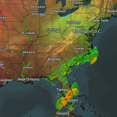
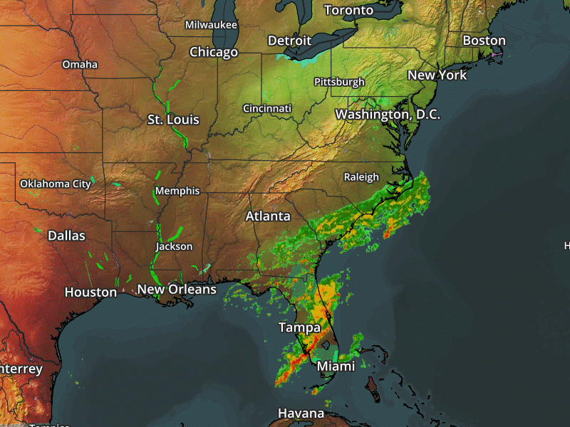

class: left, middle, slide-title

# Using AWS Lambda to Create Weather GIFs

.subtitle[
## Seth Miller and Edan Schwartz
.inline-logo[] [github.com/aerisweather/osn-2017](https://github.com/aerisweather/osn-2017)

.inline-logo[] Sponsored By: AerisWeather
]
???
Good luck! We got this!

PHPStorm window up on presentation mode on projector
- Terminal up with our server for slides
- Terminal up with invoke script to fetch image
- Terminal up with invoke script to fetch series of images
- Open CloudWatch dashboard
- Open gmail account, to receive message
- Invoke image fetcher once, to make sure everything is up and running

---
class: slide-section

# What is Lambda?
## A quick overview

---
class: slide-secondary

# What is Lambda? (Real Quick!)

1. Functional and Stateless Compute - Give it code and an input
	1. Reacts to various AWS events
	1. DB Inserts via DynamoDB
	1. API Events via API Gateway
	1. SNS Messages
--
count: false
1. Charged per 100ms used at CPU/RAM levels
	1. EC2 is hourly
--
count: false
1. No Ops - Manage only code
--
count: false

	1. ... and VPC
	1. ... and Security Groups
	1. ... and Triggers
	1. ... and Env Config

.summary["No OPs" is really more like "Less OPs"]
???
Just as a quick overview

---
class: slide-secondary
# What is Lambda good for?

1. Batch Processing
	1. Massively parallel - 1000 concurrent by default
1. Small Compute
	1. Charged in 100ms increments
	1. No idling EC2 Server
1. Spikey Workloads

---
class: slide-primary

# Our Needs

1. Large data sets coming in hourly, every 6 hours
	1. Large scale! Big data
	1. Idle resources
	1. Hard to scale up/down preemptively
???
Forecasts primary motivator
Timers kind of work but off hour still paying for hour
--
count: false
1. Parallel processing jobs
	1. Time to market is important for our customers
	1. Old weather data isn't super useful
	
--
count: false
1. Reference old data, combine new data
	1. Lots of calculations
	1. More than just a pipeline
	1. Forking and data re-use

.summary[Need: Very scalable compute solution, only charged us for time used, even less than an hour.]

---
class: slide-primary
# Why did we choose Lambda?

1. Massive concurrency
	1. Can spin up thousands of functions
	1. More parallel = Faster Time to Market
1. We have VERY spikey Workloads
	1. Fine grained cost helps a lot - sub hourly
1. Metrics for each Lambda function
	1. CloudWatch dashboards
	1. CloudWatch Log Groups
1. Other Solutions?
	1. Google Cloud Functions – Still in Beta
	1. Windows Azure Functions – It isn't AWS
	1. Open Whisk – Uses containers, cool, not a lot of support
	
---
class: slide-section
# .right-icon[]
# Data Flow Pattern
## Coordinating microservices (like Lambda)

---
class: slide-secondary
# Data Flow Architecture
## What is it?


1. Dumb Workers - "Pure" Functions .img-float-right[.size-height-150px[]]
	1. Take in single type of message
	1. Do work described in message
	1. Output result description back to mediator
	
--
count: false

1. Smart Mediator - The Brains .img-float-right[.size-height-150px[]]
	1. Where config lives
	1. Decider
	1. DB Requests
	1. Outputs messages to all workers
	
.summary[A smart mediator leads dumb workers, deploy independently]
	
---
class: slide-secondary
# Data Flow Architecture
## State Juggling

1. Application State
	1. Functions are stateless an run concurrently: 
	    - Rely on DB for ultimate source of truth
	1. DBs are made for concurrency and order
	1. Can be pretty cheap and managed
	
1. Larger Files
	1. Share storage across all workers
	1. Workers save to their own little place, readable by others

---

name:data-flow-pattern
class: slide-secondary
# Data Flow Pattern
## A smart way to organize microservices

1. Based on Simple Workflow Service
	1. SWS didn't really seem "Simple"
	1. Verbose config for each thing
	1. Forking workflows difficult
--
count: false
1. Why Data Flow?
	1. Need more advanced Workflows
	1. Microservice coordination
	1. Avoid sequential spaghetti with a common interface

???
More than a bunch of random functions calling each other
---
class: slide-section
# Demo .right-icon[]
## AWS Lambda - Weather GIFs & Thumbnails
### .inline-logo[] github.com/aerisweather/osn-2017


---
class: slide-secondary large-content
# Demo - Design

## Challenge: Create animated GIFs from weather maps
1. Download the latest weather maps every X minutes
1. For each image create a thumbnail
1. When we have enough map images, create an animated GIF
1. Send out an email with the weather GIF, and image thumbnails

.summary[Simple example, but scales really well!]

---
class: slide-secondary

.image-only[]

---
class: slide-secondary large-content
# Demo - Resources needed

* **DB** - For saving state, DynamoDB
* **Shared File Storage** - Worker storage, S3
* **4 Workers** - Lambda functions for Fetching, Thumbnail Creation, Gif Creation, Emailing
* **1 Mediator** - Lambda function to coordinate it all

---
class: slide-secondary
# Demo - Design

.center[.size-height-full[]]

---
name: worker-fetcher
class: slide-primary
# Fetcher
## Get an image via URL, save image to shared storage

Receives "please" message from outside source (timer/manually):
```json
{
  "type": "please-fetch-amp-image",
  "dateCreated": 123456789,
  "imageId": "temps",
  "layers": [
    "flat-dk",
    "temperatures"
  ],
  "width": 800,
  "height": 600,
  "center": "tulsa,ok",
  "zoom": 4,
  "validTime": 2345678910
}
```

---
name: worker-fetcher2
class: slide-primary
# Fetcher
## Get an image via URL, save image to shared storage

Fetches image, saves in storage location of worker's choice (shared)

Will send a "did" message to mediator:
```json
{
  "type": "did-fetch-amp-image",
  "dateCreated": 123456789,
  "imageId": "temps",
  "validTime": 4567891011,
  "location": {
    "Bucket": "osn2017-aeris-abcd",
    "Key": "amp-image-fetcher/[bunch of stuff].png"
  }
}
```

---
class: slide-section
# [Fetcher Code] .right-icon[]
## DEMO: Get an image via URL, save image to S3

???
In depth
* Fetch
* Save
* Send Message Back
---
name: worker-thumbnail
class: slide-primary
# Thumbnail Creator
## Load image from S3, resize/crop, save to S3

Receives "please" message (from mediator):
```json
{
  "type": "please-create-thumbnail",
  "imageId": "temps",
  "location": {
    "Bucket": "osn2017-aeris-abcd",
    "Key": "amp-image-fetcher/[bunch of stuff].png"
  },
  "width": 200,
  "height": 200,
  "validTime": 100
}
```

---
name: worker-thumbnail2
class: slide-primary
# Thumbnail Creator
## Load image from S3, resize/crop, save to S3

Will send a "did" message to mediator:
```json
{
  "type": "did-create-thumbnail",
  "dateCreated": 123456789,
  "imageId": "temps",
  "validTime": 4567891011,
  "location": {
    "Bucket": "osn2017-aeris-abcd",
    "Key": "thumbnail-creator/[bunch of stuff].png"
  }
}
```

---
class: slide-feature
# Thumbnail: .right-icon[]
## Got an image via URL, save image to S3
.feature-image[]

---
name: worker-gif
class: slide-primary
# Gif Creator
## Load list of images from S3, creates GIF, saves

Receives "please" message (from mediator):
```json
{
  "type": "please-create-gif",
  "dateCreated": 123456789,
  "gifDelay": 250,
  "gifLoop": true,
  "imageId": "demo",
  "locations": [
    { "Bucket": "osn2017-aeris-abcd", "Key": "[key]1.png" },
    { "Bucket": "osn2017-aeris-abcd", "Key": "[key]2.png" },
    { "Bucket": "osn2017-aeris-abcd", "Key": "[key]3.png" },
    { "Bucket": "osn2017-aeris-abcd", "Key": "[key]4.png" },
    { "Bucket": "osn2017-aeris-abcd", "Key": "[key]5.png" }
  ],
  "validTime": 2345678910
}
```

---
name: worker-gif2
class: slide-primary
# Gif Creator
## Load image from S3, resize/crop, save

Will send a "did" message to mediator:
```json
{
  "type": "did-create-gif",
  "dateCreated": 123456789,
  "imageId": "temps",
  "validTime": 4567891011,
  "location": {
    "Bucket": "osn2017-aeris-abcd",
    "Key": "thumbnail-creator/[bunch of stuff].gif"
  }
}
```

---
class: slide-feature
# Gif Result: .right-icon[]
## Downloaded images from S3, made gif, saved gif to S3
.feature-image[]

---
name: worker-email
class: slide-primary
# Email Sender
## Sends a message it's given

Receives "please" message (from mediator):
```json
{
  "type": "please-send-email",
  "dateCreated": 123456789,
  "to": ["user@example.com", "person@example.com"],
  "from": "dataflow@example.com",
  "body": "<b>Your image is ready:</b>Your image is ready:</b> staging -> production
1. Lots of items are repeated.
--
count: false

### Environment config on S3
1. Encrypt at rest
1. Consistent deployments
	
---
class: slide-secondary
# Coordinating Resources

Lots of little pieces (microservice architecture) can be a management nightmare!

### CI Pipeline
* Plug in your CI pipeline to AWS to publish new versions of your code
* Small/simple workers make individual updates less scary and can be done more frequently - Branches are code debt!
--
count: false

### Small Pieces
* Data Flow allows for simple explicit interfaces
* Updates can be done with little worry to each small piece
---
class: slide-primary
# Pitfalls

### Using Lambda inside VPCs can be a giant PITA
* Mediator can be run in a VPC, but need NAT gateway ($$$)
* Then has access to VPC resources like DB/Cache
* The more outside of VPCs the better
--
count: false

### Concurrent things are hard
* Lots of things going on at once
* Simultaneous logs and invocations all happening at once

---
class: slide-primary
# Pitfalls

### Event hubs are all side effects
* Not always explicit what will happen
--
count: false

### Where else will you hit a scaling issue? Once you "leave lambda"
--
count: false

### Lambda Limits (can't ask for more)
* 1.5GB RAM max
* 512MB of disk in /tmp
* 50MB zipped code / 250MB unzipped
* Can't write to code dir

---
class: slide-primary, large-content
# Try it for Yourself!

* Use our project as a boilerplate
* Provisioning script creates CloudFormation Template
* All AWS Free Tier resources
* `cd demo; npm run deploy` - Should be about all that's needed

---

class:  slide-primary
# Questions?
### .inline-logo[] Sponsored By: AerisWeather

### .inline-logo[] [github.com/aerisweather/osn-2017](https://github.com/aerisweather/osn-2017)
#### Free Demo Accounts API and Maps: https://aerisweather.com
#### We're Hiring: https://aerisweather.com/careers/senior-api-developer/
## Thanks!

.presenter-block[
.headshot[]
# Seth Miller
.connect-logo[] [four43](https://github.com/four43)
]
.presenter-block[
.headshot[]
# Edan Schwartz 
.connect-logo[] [eschwartz](https://github.com/eschwartz)
]

???
ASK FOR QUESTIONS LAST
- We will be at happy hour
---

name: image-amp-image-fetcher
count: false
class: center, middle, slide-primary
### AMP Image Fetcher Result:

---
name: image-thumbnail-creator
count: false
class: center, middle, slide-primary
### Thumbnail Creator Result:

---
name: image-gif-creator
count: false
class: center, middle, slide-primary
### GIF Creator Result:


---
@ todo:

Fill in github link
Remove credentials
Save all images locally

---
